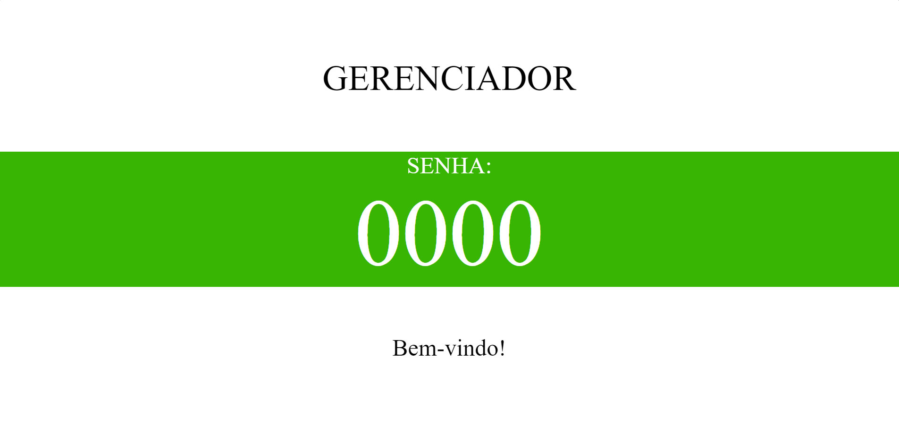

# Gerenciador-de-senha

**Descrição:**

Foi desenvolvido um sistema com HTML, CSS e JS, um gerenciador de senha para controle de fila.

**Modo de utilização:** 

Seta para cima chama o próximo número, Seta para baixo chama o número anterior.

**Link do projeto:** 

https://maike-simoncini.github.io/Gerador-de-senha/
